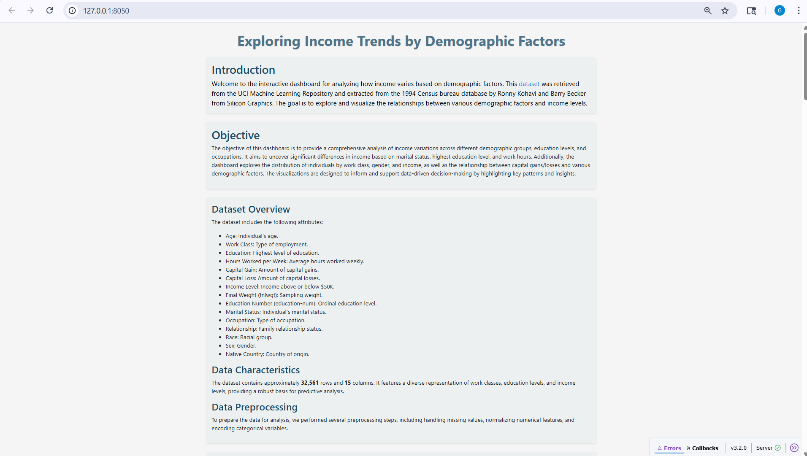
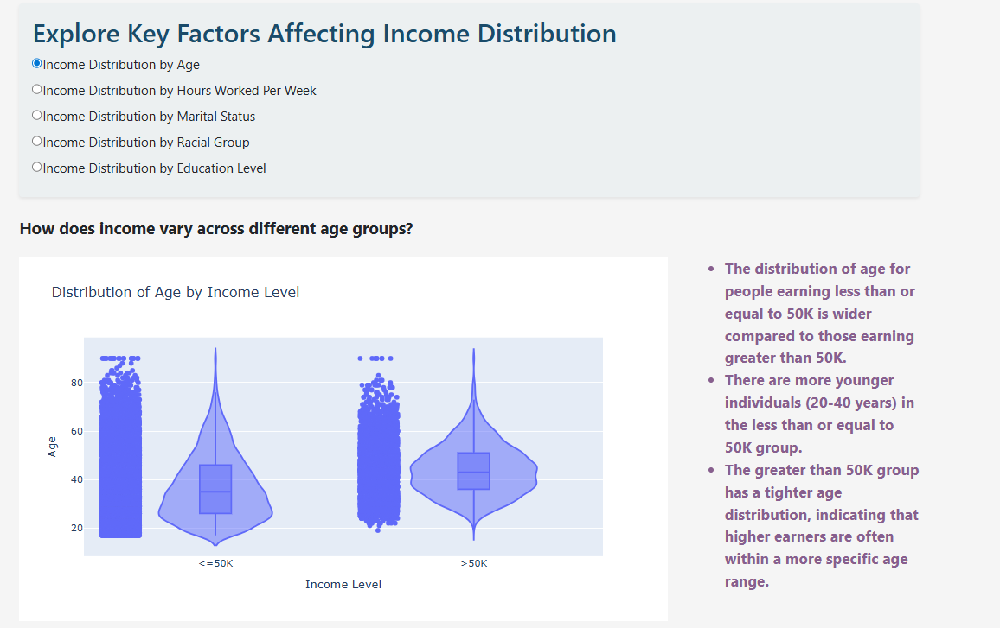
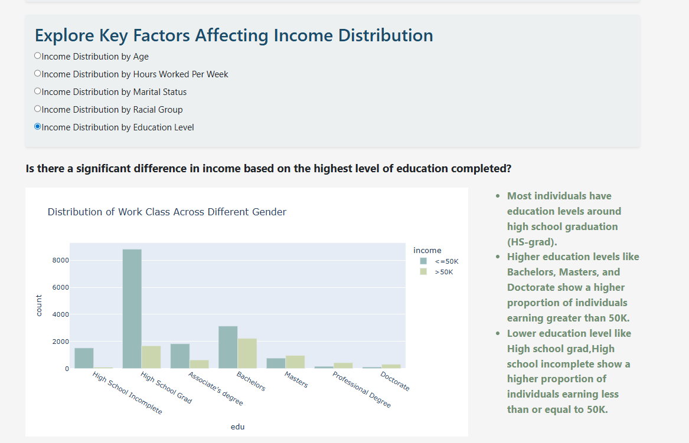
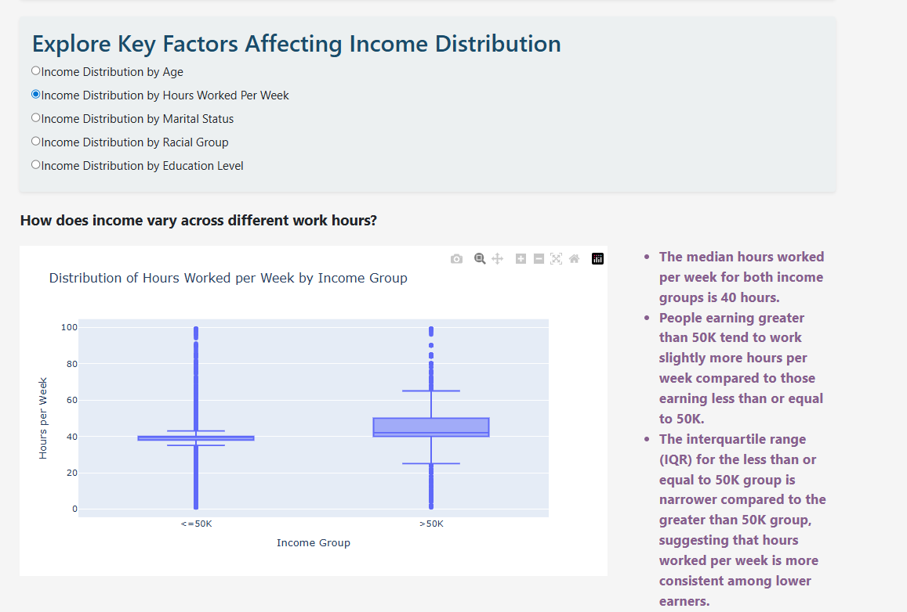
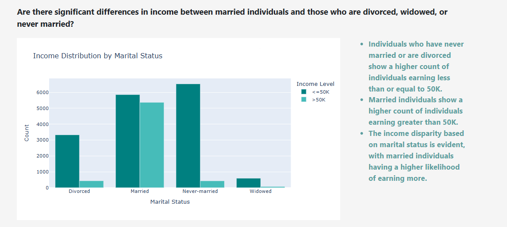
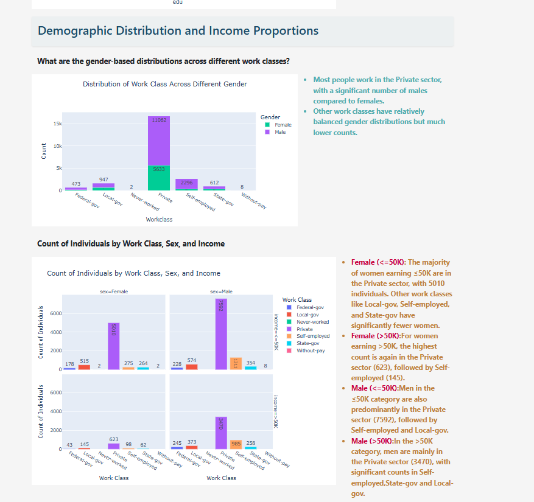
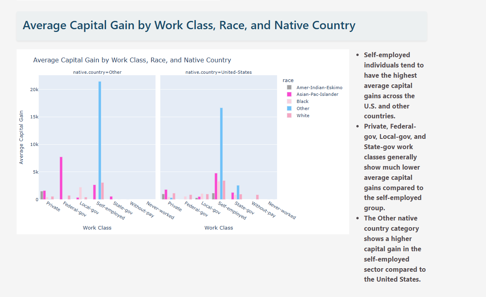
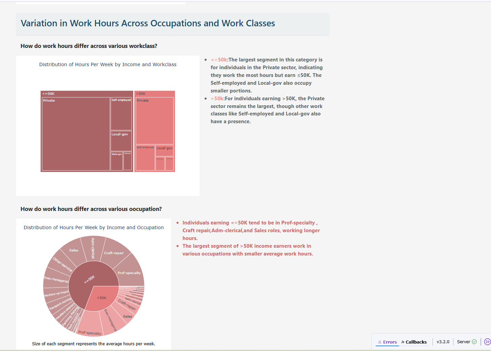
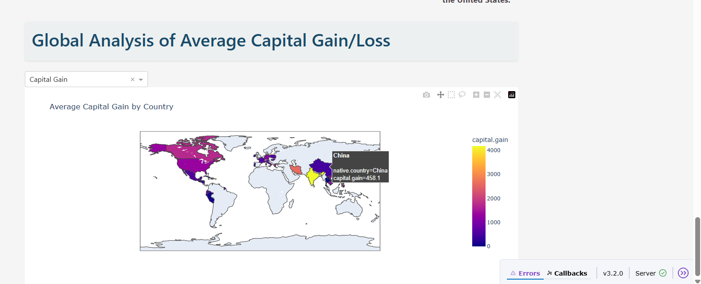

# 📊 Income Distribution Dashboard

An interactive dashboard built with **Dash** and **Plotly** to analyze income trends across demographics using the UCI Adult Census dataset. This project includes data cleaning, statistical testing, and exploratory visualizations.

---

## 🚀 Features

- Cleaned and preprocessed UCI Adult Census data using pandas
- Applied statistical tests (Mann-Whitney U, Kruskal-Wallis, Chi-Square, Spearman)
- Created 10+ reusable visualizations (violin plots, sunburst, choropleth maps, etc.)
- Enabled user-driven filtering and dynamic updates using Dash callbacks
- Responsive layout styled with Plotly and Bootstrap

---

## 📁 Dataset

- Source: [UCI Machine Learning Repository](https://archive.ics.uci.edu/ml/datasets/adult)
- File included: `refined_adult.csv`

---

## 🛠️ How to Run Locally

### 1. Clone the repository

```bash
git clone https://github.com/yourusername/income-distribution-dashboard.git
cd income-distribution-dashboard

2. Install dependencies
Make sure you're using Python ≥ 3.7, then run:
pip install -r requirements.txt

3. Start the app
python app.py

## 📸 Preview

Here's a quick look at the dashboard and visualizations:

### Dashboard Home View















](https://raw.githubusercontent.com/Akanksha1Saxena/income-distribution-dashboard/main/images/Average_Capital_Gain_by_Work_Class_Race_and_Native_Country.png)





